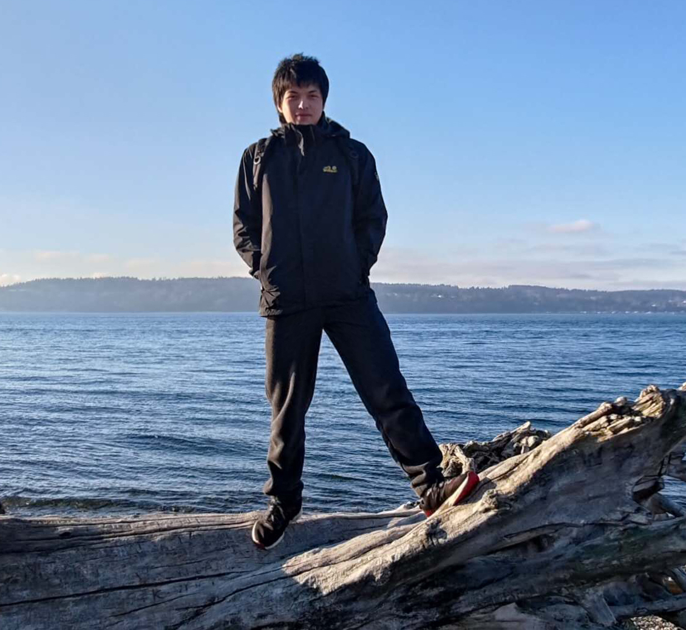
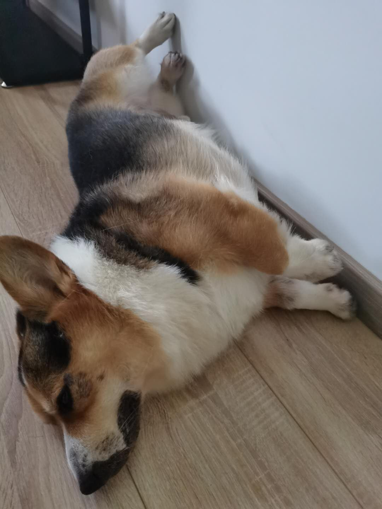
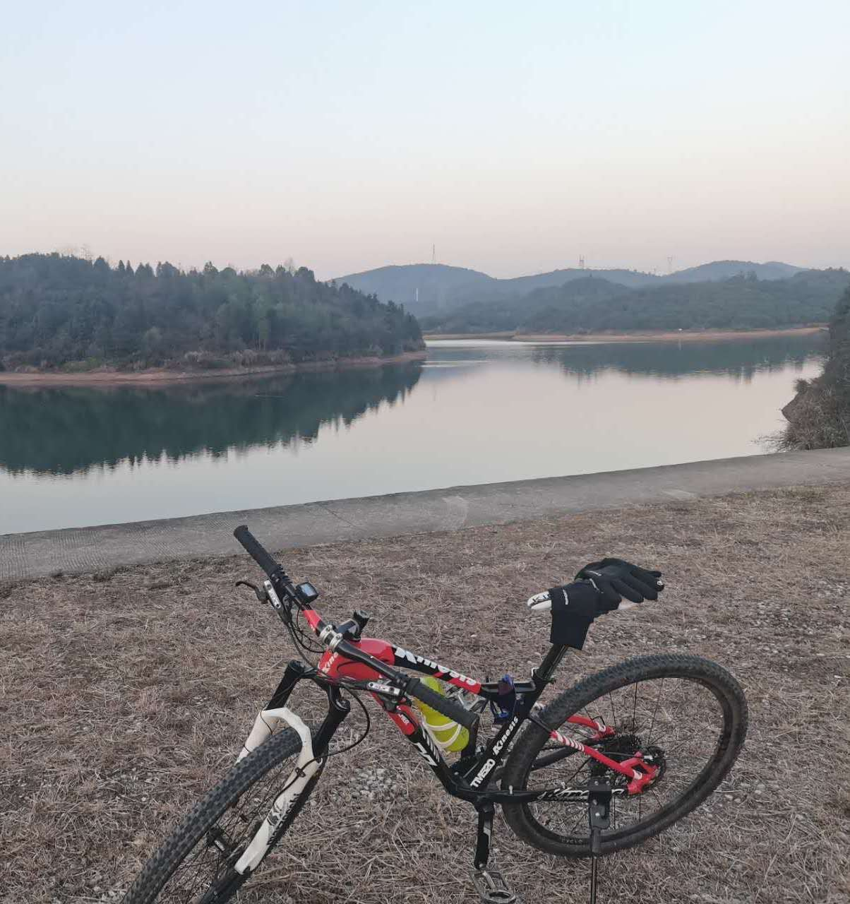
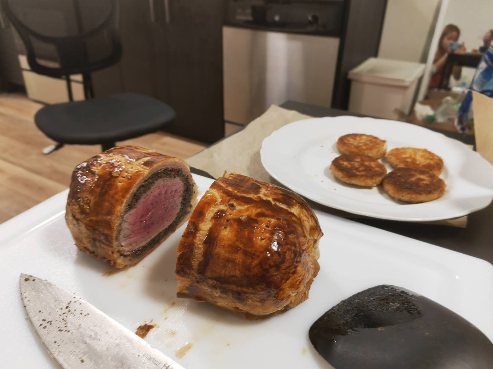

# AboutMe Page For Jiuyang Lyu

## Introduction

Hi, I am Jiuyang Lyu, an international student from China. I am sophmore in ECE major and my interests pathways are robotics, machine learning, and VLSI. I take EE 201, 280, 271, and CSE 333, 414 this quarter. Please feel free to contact me and form a study group with me.

## My interest

I am interested in robotics, soccer, cycling, cooking, and traveling. I play Civilization VI sometime.

## About my hometown

I was born and raised in Zhuzhou, Hunan province, China. The food in my hometown is really spicy (Hunan cuisine is one of the hottest cuisine in China!) I have one Welsh Corgi(named Kedou) in my hometown. I have been Seattle for over one year and I really miss my families and Kedou.

## Here are some photos

